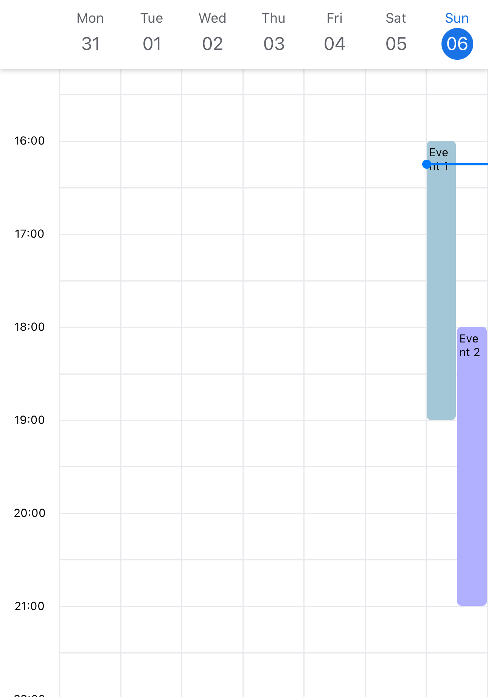

# Events

Events will be displayed in the timeline view. `events` is a array of [EventItem](#eventitem-props)

## Example

```jsx title="Example"
import { SafeAreaView, Text } from 'react-native';
import React from 'react';
import { TimelineCalendar, EventItem } from 'rn-calendar-kit';

const exampleEvents: EventItem[] = [
  {
    id: '1',
    title: 'Event 1',
    start: '2022-11-06T09:00:05.313Z',
    end: '2022-11-06T12:00:05.313Z',
    color: '#A3C7D6',
  },
  {
    id: '2',
    title: 'Event 2',
    start: '2022-11-06T11:00:05.313Z',
    end: '2022-11-06T14:00:05.313Z',
    color: '#B1AFFF',
  },
];

const Calendar = () => {
  return (
    <SafeAreaView style={styles.container}>
      <TimelineCalendar viewMode="week" events={exampleEvents} />
    </SafeAreaView>
  );
};

export default Calendar;

const style = StyleSheet.create({
  container: { flex: 1, backgroundColor: '#FFF' },
});
```



## EventItem Props

### id

`Required`

Unique ID for the event.

<span style={{color: "grey"}}>string</span>

### start

`Required`

Start date of the event

<span style={{color: "grey"}}>string</span>

### end

`Required`

End date of the event

<span style={{color: "grey"}}>string</span>

### title

Title of the event

<span style={{color: "grey"}}>string</span>

### color

Color of the event

<span style={{color: "grey"}}>string</span>

### containerStyle

Container style of the event

<span style={{color: "grey"}}>ViewStyle</span>

### Other props

You can add more properties to use with **[renderEventContent](#)**

Example

```ts
const exampleEvents: EventItem = [
  {
    id: '1',
    title: 'Event 1',
    start: '2022-11-06T09:00:05.313Z',
    end: '2022-11-06T12:00:05.313Z',
    color: '#A3C7D6',
    description: 'Hello world',
  },
  {
    id: '2',
    title: 'Event 2',
    start: '2022-11-06T11:00:05.313Z',
    end: '2022-11-06T14:00:05.313Z',
    color: '#B1AFFF',
    imageUrl: 'https://picsum.photos/200/300',
  },
];
```
